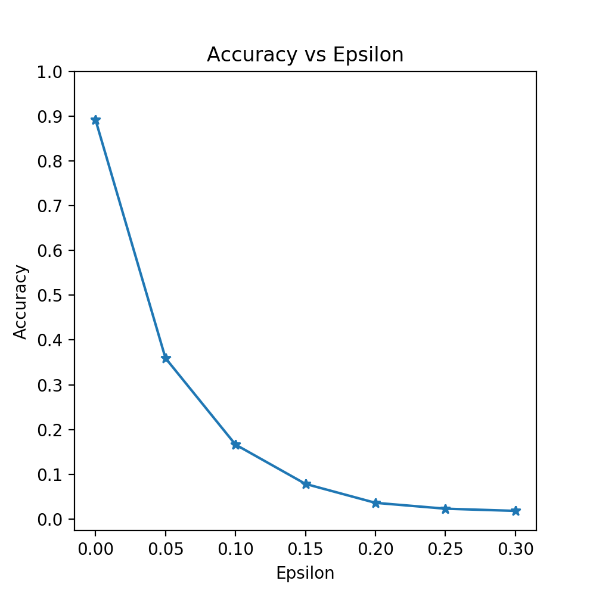

# CNN_pytorch evasion attack on Fashion MNIST
This repository consists of my implementation of Adversarial CNN model in pytorch, hitting 89.22% on Fashion-MNIST test dataset. Trained model also was provided in order to run the attack. Based on our trained model we implemented evasion attack (FGSM). Results are:

Epsilon: 0      Test Accuracy = 8922 / 10000 = 0.8922 /n

Epsilon: 0.05   Test Accuracy = 3595 / 10000 = 0.3595

Epsilon: 0.1    Test Accuracy = 1663 / 10000 = 0.1663

Epsilon: 0.15   Test Accuracy = 784 / 10000 = 0.0784

Epsilon: 0.2    Test Accuracy = 361 / 10000 = 0.0361

Epsilon: 0.25   Test Accuracy = 230 / 10000 = 0.023

Epsilon: 0.3    Test Accuracy = 181 / 10000 = 0.0181

In folder 'saved' you can see the result figure 'accuracy vs epsilon':
 

where the higher epsilon is, the lower the accuracy of our model. Next I would like to read papers where CNN model accuracy is higher than 90%, retrain my model and rerun again the attack.
